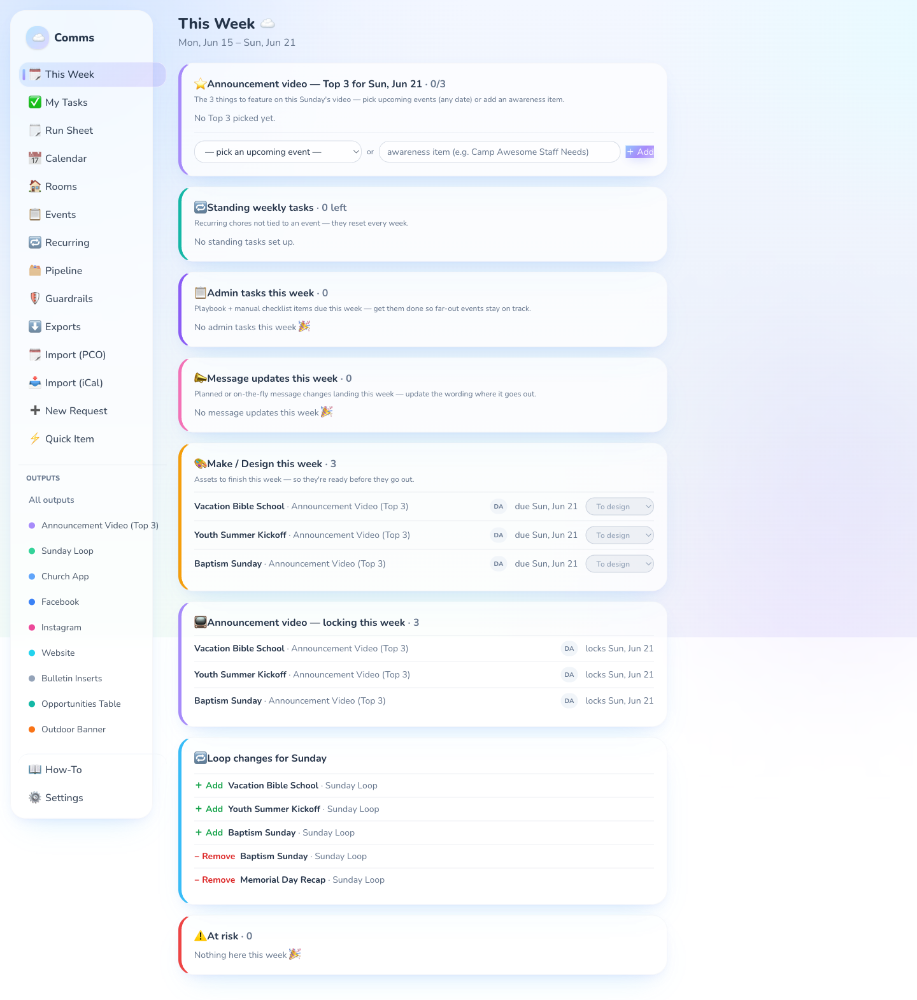
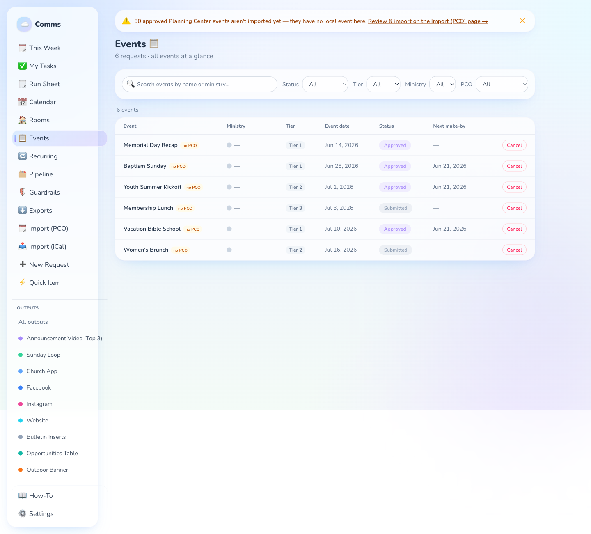
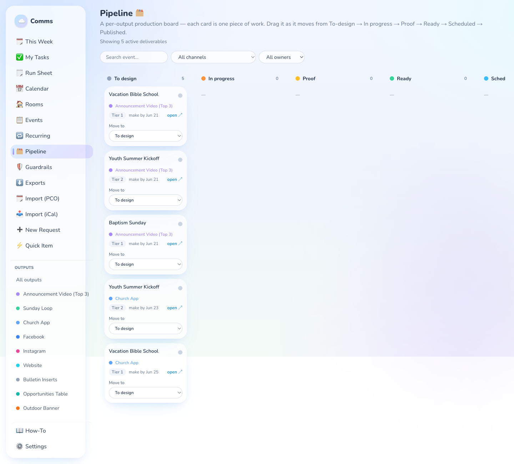
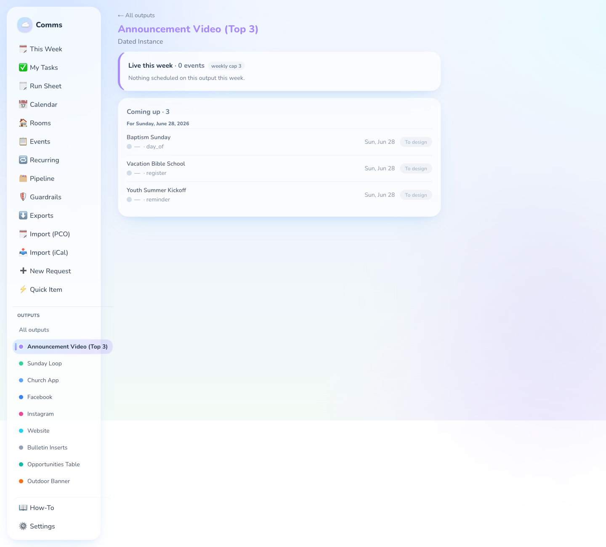

# Church Comms

Church Comms is a self-hosted communications planning app for churches. It turns
event requests into a promotion plan: intake, triage, tiering, channel scheduling,
production tasks, weekly worklists, run sheets, exports, and optional Planning
Center Calendar imports.

The app does not publish to external tools. It tells a communications team what
needs to be made, when it is due, and where it should appear.

Church Comms is source-available for noncommercial use under the PolyForm
Noncommercial License 1.0.0. You may not sell this product, offer it as a paid
hosted service, or otherwise use it for commercial purposes without separate
written permission from the maintainer.

## What It Does

- Public request intake and requester status pages.
- Admin triage, tiering, approvals, and guardrail warnings.
- Reverse-timeline scheduling for channels like announcement video, lobby loop,
  app, website, email, social, bulletin, and physical signage.
- "This Week", calendar, run sheet, output previews, and export routes.
- Per-event deliverables, owners, proof links, assets, and activity history.
- Optional one-way Planning Center Calendar import for approved events and rooms.
- Optional local iCal import preview for reconciling another calendar source.
- SQLite database, Prisma migrations, and built-in backup/restore scripts.

## Screenshots

The screenshots below use the public demo seed data.









## Stack

- Next.js App Router
- React
- Prisma
- SQLite
- Auth.js credentials auth
- Nodemailer for optional outbound email
- Vitest and ESLint

## Quickstart

```bash
npm ci
cp .env.example .env
openssl rand -base64 32 # paste into AUTH_SECRET in .env
npm run prisma:generate
npm run db:prepare
ADMIN_PASSWORD='change-me' npx tsx prisma/seed.ts
npm run dev
```

Open `http://localhost:3000` and sign in with:

- Email: `admin@example.church`
- Password: the `ADMIN_PASSWORD` you used when seeding

The seed creates demo channels, ministries, users, sample requests, playbooks,
tag rules, and settings. It is for local/demo setup only. Do not run the demo
seed against a production database unless you intentionally want sample data.

`npm run db:prepare` handles both public fresh installs and existing live
instances. On a blank SQLite database it creates the current schema baseline and
marks the historical migrations as satisfied. On an existing Prisma-managed
database it runs `prisma migrate deploy` to apply only pending migrations.

## Configuration

Copy `.env.example` to `.env`. Required:

```bash
DATABASE_URL="file:./dev.db"
AUTH_SECRET="replace-with-openssl-rand-base64-32"
```

Optional:

- `APP_URL` - base URL used in status links inside emails.
- `SMTP_HOST`, `SMTP_PORT`, `SMTP_USER`, `SMTP_PASS`, `SMTP_FROM` - outbound email.
- `PLANNING_CENTER_APP_ID`, `PLANNING_CENTER_SECRET` - Planning Center Personal
  Access Token credentials.
- `PCO_APP_ID`, `PCO_SECRET`, or `PCO_TOKEN` - alternative Planning Center auth.
- `CRON_SECRET` - bearer token for scheduled PCO sync.
- `GOOGLE_EVENTS_ICAL_URL` or `GOOGLE_EVENTS_CALENDAR_URL` - optional external
  calendar preview.
- `ICAL_IMPORT_FILE` - absolute path to a local `.ics` file for manual import.
- `BACKUP_REMOTE` - optional `rclone` remote for off-box backups.
- `ENABLE_APP_UPDATER`, `UPDATE_REMOTE`, `UPDATE_BRANCH`, `PM2_APP_NAME`, and
  `UPDATE_RESTART_CMD` - optional trusted-machine updater controls.

Real `.env` files, SQLite databases, backups, local imports, and instance-only
files are ignored by git.

## Planning Center

Planning Center is optional. When configured, this app reads approved Calendar
events and room/resource bookings. It does not write back to Planning Center.

Set one credential mode:

```bash
PLANNING_CENTER_APP_ID=
PLANNING_CENTER_SECRET=

# or
PCO_APP_ID=
PCO_SECRET=

# or
PCO_TOKEN=
```

Scheduled sync is protected by `CRON_SECRET`:

```cron
*/30 * * * * curl -fsS -H "Authorization: Bearer $CRON_SECRET" http://localhost:3000/api/cron/sync-events
```

See `docs/pco-forms-setup.md` and `docs/pco-event-templates.md` for generic PCO
setup guidance.

## Production

Use production-safe migrations and back up before upgrades.

```bash
npm ci
npm run prisma:generate
npm run db:prepare
npm run build
TZ=America/Chicago NODE_ENV=production npm run start
```

For long-running deployment options, see `docs/RUNBOOK.md` and the files in
`deploy/`.

## Backups

The system of record is the SQLite file configured by `DATABASE_URL`.

```bash
npm run backup
```

Backups are written to `backups/`, integrity checked, pruned, and optionally
copied off-box with `rclone` when `BACKUP_REMOTE` is set.

## Upgrading An Instance

For a live church instance:

1. Run `npm run backup`.
2. Fetch the release tag or latest approved commit.
3. Run `npm ci`.
4. Run `npm run prisma:generate`.
5. Run `npm run db:prepare`.
6. Run `npm run build`.
7. Restart the process manager.

Use semver release tags such as `v1.0.0`. Release notes should call out whether
Prisma migrations are included.

On a trusted always-on local machine, admins can also use `Settings > Updates`
when `ENABLE_APP_UPDATER=true` is set. The built-in updater checks GitHub,
backs up the database, fast-forwards the configured branch, installs
dependencies, prepares Prisma, builds, and restarts the process manager.

## Keeping A Live Church Instance

The GitHub repo is the product: code, migrations, generic docs, and demo seed
data. Your church instance is the ignored local state:

- `.env` stores church-specific secrets and integration URLs.
- `dev.db` or the `DATABASE_URL` SQLite file stores real requests, ministries,
  channels, tag rules, playbooks, templates, Planning Center mirrors, and users.
- `backups/`, `instance/`, `local-instance/`, and `local-data/` are for private
  exports, imports, operational notes, and one-off scripts.

That means a live church setup can be full of church content
without committing that content to GitHub. Upgrade the app code from GitHub,
keep the same `.env` and SQLite database file, run `db:prepare`, rebuild, and
restart. Do not run the demo seed on the live database after setup; manage live
ministries, channels, tag rules, playbooks, and templates through the app or
small ignored local scripts.

If a change is useful for every church, make it in the public repo and open a
PR. If a change is only for one church, keep it as database configuration or in
an ignored instance folder so future upgrades stay clean.

## Contributing

Contributions are welcome. Please open an issue before large changes, keep
church-specific data out of commits, and run:

```bash
npm run lint
npm test
npm run build
```

See `CONTRIBUTING.md` for details.

## Security

Do not commit real church data, `.env` files, SQLite databases, backups, or
Planning Center credentials. Report private security issues using the process in
`SECURITY.md`.

## License

PolyForm Noncommercial License 1.0.0. See `LICENSE`.

This is a source-available noncommercial project, not an OSI-approved open
source project. Commercial use, resale, paid hosting, sublicensing, or selling
copies of Church Comms requires separate written permission from the maintainer.
